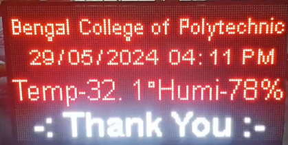
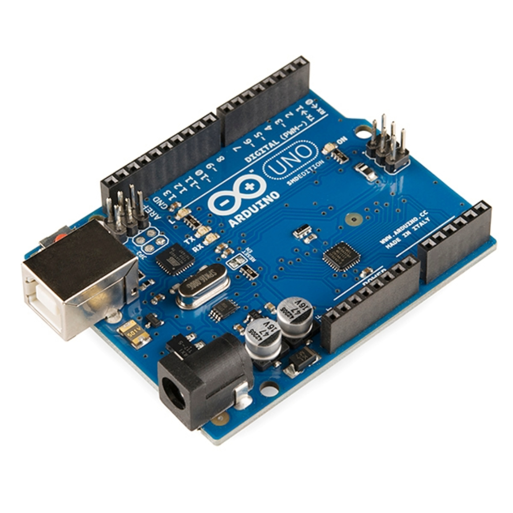
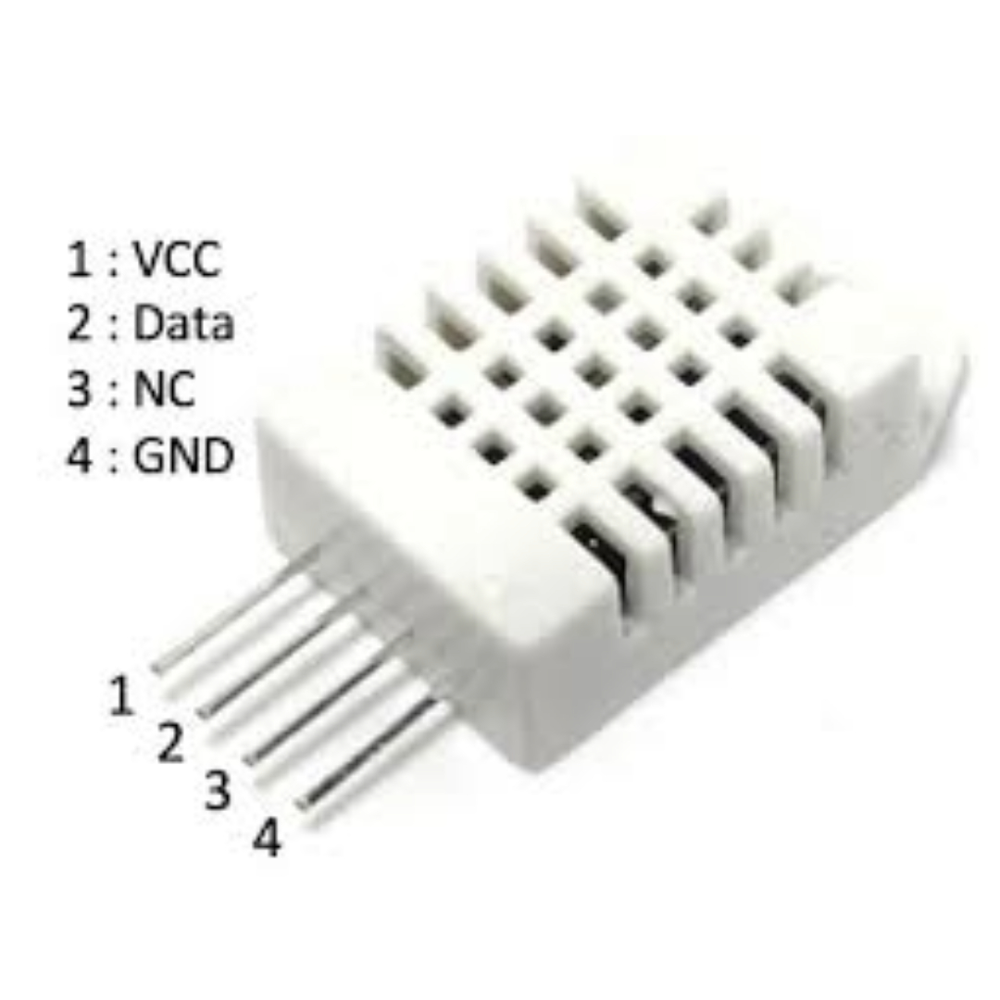
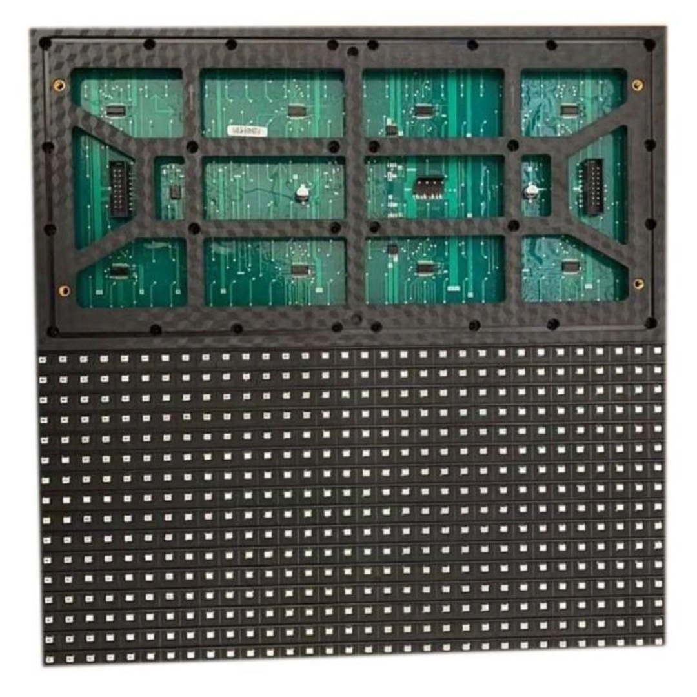
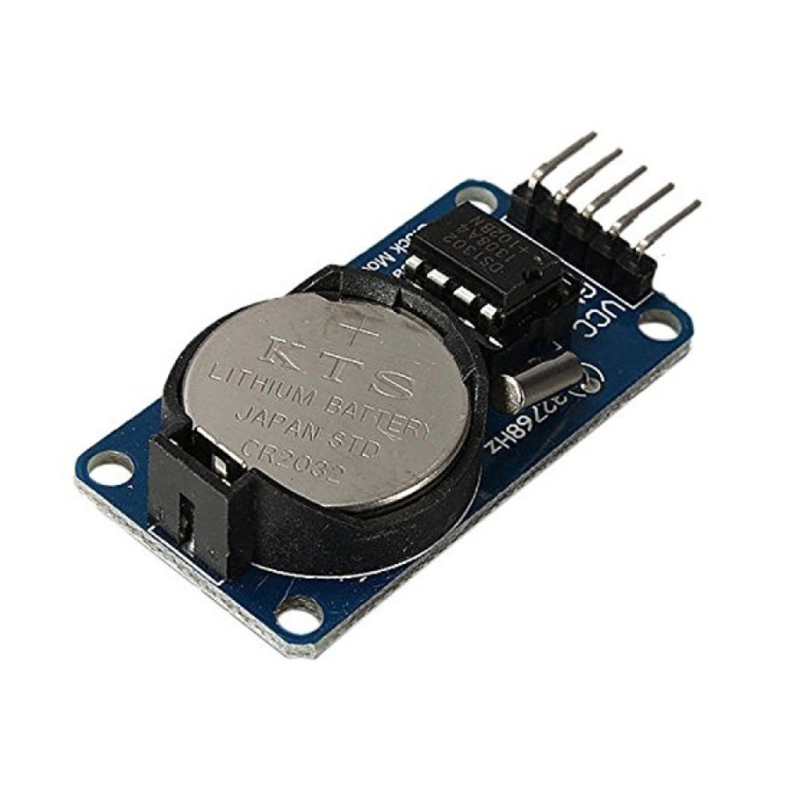
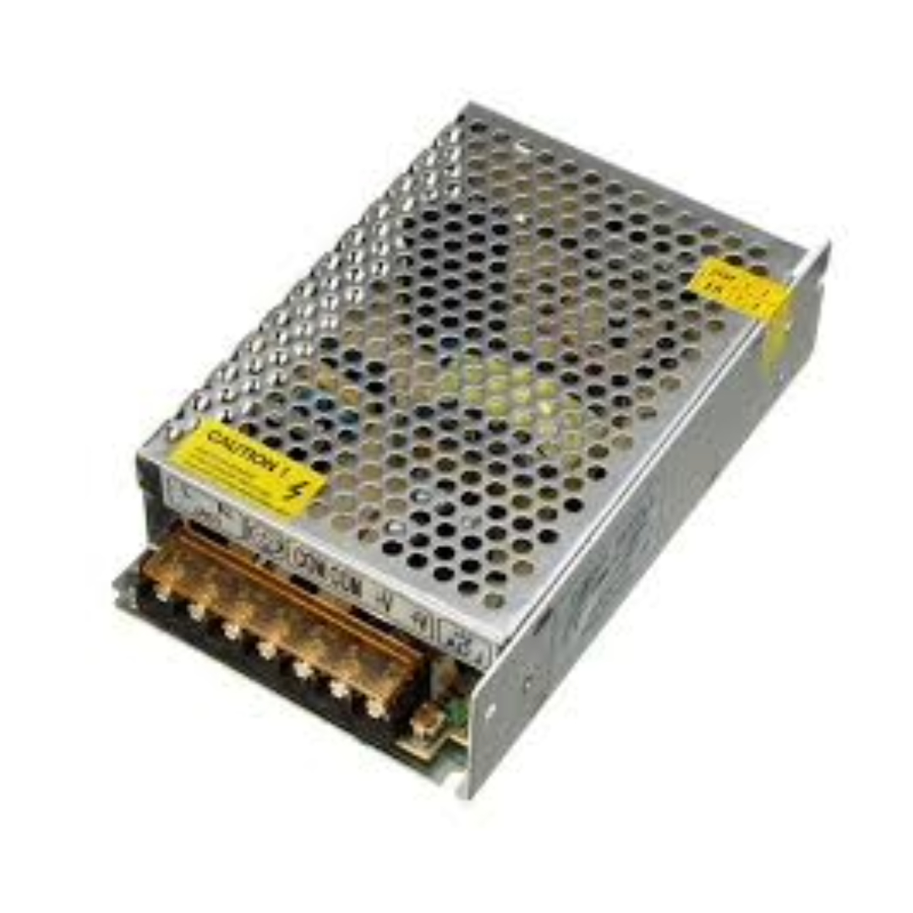
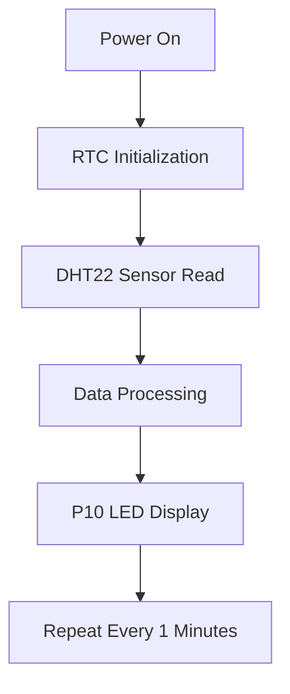

# 🌦️ IoT Weather Monitoring & Display System 🌡️ [Batch 2021-2024]

As a faculty member of the Computer Science and Technology (CST) department, I had the privilege of serving as the project coordinator for "Weather Display Board in College Campus". This innovative project aimed to 

i) Design and develop an interactive display board 

ii) Showcases real-time weather updates, providing students, faculty, and staff with a convenient and accessible means of staying informed about current weather conditions on campus.

A real-time weather monitoring system with LED display capabilities using IoT components.

 

## 🛠️ Hardware Components
| Component              | Quantity | Image                      |
|------------------------|----------|----------------------------|
| Arduino Uno            | 1        |  |
| DHT22 Sensor           | 1        |     |
| P10 LED Module (DMD)   | 16        |     |
| RTC Module             | 1        |         |
| SMPS 16A               | 1        |       |

## 💻 Software Used

## 📋 System Process Flow

### 🎥 Demo Video
1. https://github.com/user-attachments/assets/82dcd58c-07ed-447a-b3dd-98a2bfbe6d50

2. https://github.com/user-attachments/assets/d4ce427b-b08d-433d-99a2-e957efd91fe5

### 🔌 Wiring Diagram

Final Circuit Images: 

Component	Arduino Pin	Color Code

DHT22 Data	D2	🟢 Green

RTC SCL	A5	🔵 Blue

RTC SDA	A4	🟡 Yellow

P10 CLK	D13	🔴 Red

P10 DATA	D11	⚪ White
